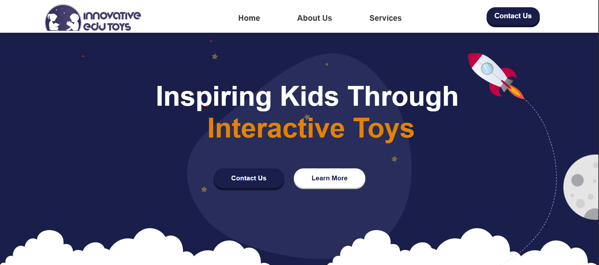
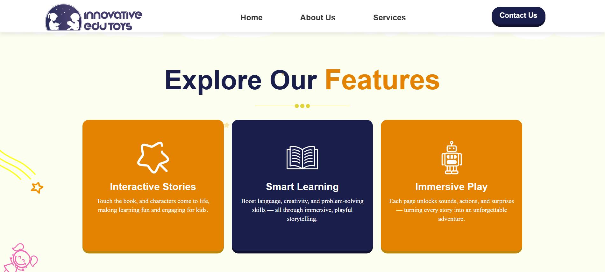

# Innovative Edu Toys — Design Showcase

Welcome to the design showcase for **Innovative Edu Toys** — an interactive educational toy brand aimed at inspiring kids through engaging and playful learning experiences.

---

## About the Project

This repository contains the **design files and prototypes** created for Innovative Edu Toys. These include website mockups, UI layouts, and graphic assets showcasing the brand’s interactive storytelling and immersive play concepts.

---

## Design Highlights

- Clean, kid-friendly website design  
- Interactive storytelling visuals  
- Engaging and colorful UI elements  
- Focus on intuitive navigation and playful interaction

---

## Screenshots / Mockups

  
  

*Note: These images are design mockups, not a live website.*

---

## Tools Used

- HTML, CSS, JavaScript 

---

## Contact

For questions or collaboration opportunities, reach out to me:  
**Email:** shettyshifali27@gmail.com  
**LinkedIn:** [linkedin.com/in/shifali-shetty-323620248](https://www.linkedin.com/in/shifali-shetty-323620248/)

---

*Thank you for visiting my design portfolio!*
